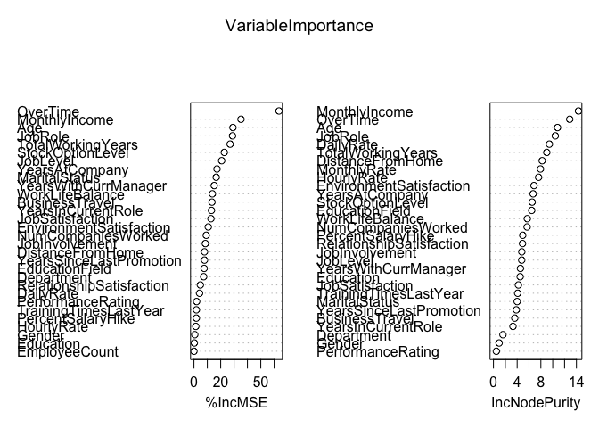
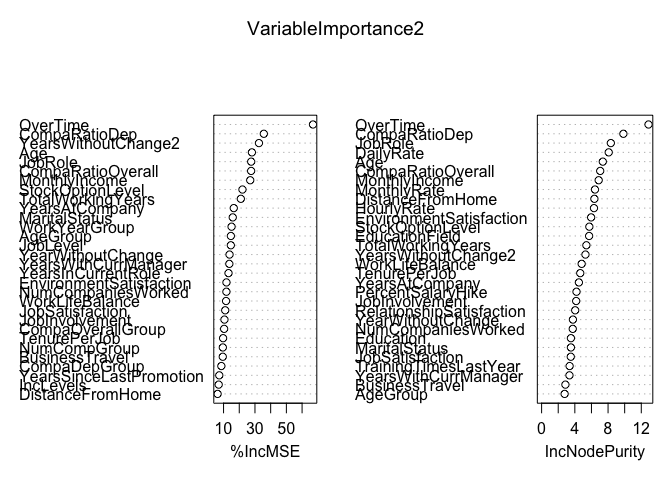
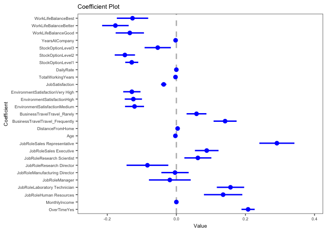
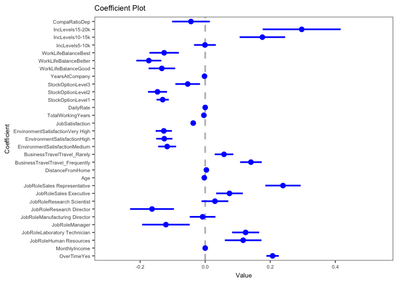

# Executive Summary  

##Problem and Motivation  

The cost replacing an entry-level employee is 50% of that employee's salary, and
for a supervisory role, that percentage increases as high as 150%! Within this
notebook we explore the most predictive variables that lead to attrition and
retain talent within DDSAnalystics Talent Management dataset. At a high level,
we found that the four most predictive factors that lead to attrition were: over
time, monthly income, job role and business travel. The 4 most predictive
factors that retain talent are: work life balance, environment satisfaction,
stock options, compensation department ratio.

##Variable Explination  

The explanatory variable overtime in the data set is stored as a boolean
categorical type with  “Yes” and “No” values. The variable monthly income is
provided as a raw continuous field that was bucketed into bins in order to
provide more predictive power. The buckets created contain 4 levels: 0-5000,
5000-10000, 10000-20000 and 20000-max. Job role is defined in the dataset as a
categorical variable with 9 levels. These 9 levels range from roles like:
“Laboratory Technician” to “Sales Executive”. Business travel is a categorical
variable that contains 3 levels: Frequent, Rarely, and None – thus the employee
travels often on behalf of their role, rarely on behalf of their role, or never.
The work life balance variable is a numerical factor in which 1 represents “Bad
Work Life Balance” and 4 represents “Best Work Life Balance”. Environment
satisfaction is a numerical factor with variable with 4 levels: “Low Environment
Satisfaction", "Medium Environment Satisfaction", "High Environment
Satisfaction" , “Very High Environment Satisfaction”. Stock option benefits for
employees are represented in the dataset as a numerical factor with 4 levels:
0,1,2,3. The 0 refers to no stock options and the 3 refers to the greatest stock
options. Lastly, the compensation department ratio variable is a engineered
feature calculation that takes the raw monthly income of the employee and
divides it by the mean monthly income of everyone in that department.

##Results and Outcome  

While over time, monthly income, job role, business travel lead to attrition and
work life balance, employment satisfaction and stock options retain talent, we
found that these specific variables only lead to an explainability of about 30%.
In order to conduct this analysis, we built over 50 different models for EDA,
ranging from simple linear regressions to decision trees and random forests. We
created over 14 engineered features.  

In conclusion, we found that employee retention is a difficult and complex
problem to solve! However, there is rich and fruitful insights that can be
gained from leveraging this dataset. In addition, we believe building and
productionalizing an employee retention model would yield promising results and
opens up opportunities for great savings. In order to improve model
explainability, more data would be extremely beneficial. We also believe there
is a lot of room for improvement with the current dataset.  

##Next Steps  

For variable selection and creation, with 34 explanatory variables, 2 of which
contained no variability – we believe that more explanatory variables could
better represent the complex environment of employee attrition. Some potential
variables include: time series employee and company data. This would allow for
the ability to track changes within an employee’s lifecycle and life events at
the company. An excellent practical example of this would be big life events
that often evoke moving: marriage and death. In addition, detailed company
demographic variables like office location, organizational changes, news and
press articles could show potential predictive power. Delving more into detailed
employee demographics like health benefits, and remote working opportunities
could help extrapolate insight into why employees leave (and stay!). Other
useful information that could prove important is any competitor information and
employee feedback forms!  

In terms of model selection and data exploration techniques, there are always
opportunities for more advanced dimensionality reduction techniques like KNN and
PCA. We could also do more feature engineering with respect to oversampling
techniques. We also would like to explore insights given by building using
nueral networks.

#Introduction  

This github projct is a complilation of extensive exploratory data analysis
regarding DDSAnalytics employee retention data. Below you will find techniques
accumlicated over 15 weeks in Southern Methodist University Masters in Data
Science program MSDS6306 Doing Data Science class. We were provided a single
excel spread sheet with attrition data and asked to glean insights leveraging
all the techniques covered throughout the semester. The goal was to create a
final presentation in which we would showcase the insights we found. In addition
to the presentation, we were required to create an R markdown file that would
allow for reproducibility in the event DDSAnalytics would like to build, or
leverage any of our findings in the future. You will find an executive summary
providing technical insight into the results, as well as the code used to
generate said insights. Enjoy!

# Analysis  


```
## Warning in randomForest.default(m, y, ...): The response has five or fewer
## unique values. Are you sure you want to do regression?
```

<!-- -->

```
## Warning in randomForest.default(m, y, ...): The response has five or fewer
## unique values. Are you sure you want to do regression?
```

<!-- -->


## Process Data  
First we need to import the client excel data and convert it into 
more accessible R objects. 


```r
# Load Data ---------------------------------------------------------------
# Create target file
hr_data_file <- file("data/hr-data.rds");
hr_definitions_file <- file("data/hr-definitions.rds");
#' Read first sheet excel document into R
hr_data <- read_excel("data/raw-client-data.xlsx");
hr_definitions <- read_excel("data/raw-client-data.xlsx", sheet = 2, col_names = F, trim_ws = T);


# Save objects
saveRDS(hr_data, hr_data_file);
saveRDS(hr_definitions, hr_definitions_file)


# close files -------------------------------------------------------------
close(hr_definitions_file,hr_data_file);
```

Now that we have the data loaded we can evaluate the classes, features, and cleanness.


```r
raw_data_df <- readRDS("data/hr-data.rds");
raw_definitions_df <- readRDS("data/hr-definitions.rds")

# Raw Data Structures
str(raw_data_df);
str(raw_definitions_df)
## Classes 'tbl_df', 'tbl' and 'data.frame':	1470 obs. of  35 variables:
##  $ Age                     : num  41 49 37 33 27 32 59 30 38 36 ...
##  $ Attrition               : chr  "Yes" "No" "Yes" "No" ...
##  $ BusinessTravel          : chr  "Travel_Rarely" "Travel_Frequently" "Travel_Rarely" "Travel_Frequently" ...
##  $ DailyRate               : num  1102 279 1373 1392 591 ...
##  $ Department              : chr  "Sales" "Research & Development" "Research & Development" "Research & Development" ...
##  $ DistanceFromHome        : num  1 8 2 3 2 2 3 24 23 27 ...
##  $ Education               : num  2 1 2 4 1 2 3 1 3 3 ...
##  $ EducationField          : chr  "Life Sciences" "Life Sciences" "Other" "Life Sciences" ...
##  $ EmployeeCount           : num  1 1 1 1 1 1 1 1 1 1 ...
##  $ EmployeeNumber          : num  1 2 4 5 7 8 10 11 12 13 ...
##  $ EnvironmentSatisfaction : num  2 3 4 4 1 4 3 4 4 3 ...
##  $ Gender                  : chr  "Female" "Male" "Male" "Female" ...
##  $ HourlyRate              : num  94 61 92 56 40 79 81 67 44 94 ...
##  $ JobInvolvement          : num  3 2 2 3 3 3 4 3 2 3 ...
##  $ JobLevel                : num  2 2 1 1 1 1 1 1 3 2 ...
##  $ JobRole                 : chr  "Sales Executive" "Research Scientist" "Laboratory Technician" "Research Scientist" ...
##  $ JobSatisfaction         : num  4 2 3 3 2 4 1 3 3 3 ...
##  $ MaritalStatus           : chr  "Single" "Married" "Single" "Married" ...
##  $ MonthlyIncome           : num  5993 5130 2090 2909 3468 ...
##  $ MonthlyRate             : num  19479 24907 2396 23159 16632 ...
##  $ NumCompaniesWorked      : num  8 1 6 1 9 0 4 1 0 6 ...
##  $ Over18                  : chr  "Y" "Y" "Y" "Y" ...
##  $ OverTime                : chr  "Yes" "No" "Yes" "Yes" ...
##  $ PercentSalaryHike       : num  11 23 15 11 12 13 20 22 21 13 ...
##  $ PerformanceRating       : num  3 4 3 3 3 3 4 4 4 3 ...
##  $ RelationshipSatisfaction: num  1 4 2 3 4 3 1 2 2 2 ...
##  $ StandardHours           : num  80 80 80 80 80 80 80 80 80 80 ...
##  $ StockOptionLevel        : num  0 1 0 0 1 0 3 1 0 2 ...
##  $ TotalWorkingYears       : num  8 10 7 8 6 8 12 1 10 17 ...
##  $ TrainingTimesLastYear   : num  0 3 3 3 3 2 3 2 2 3 ...
##  $ WorkLifeBalance         : num  1 3 3 3 3 2 2 3 3 2 ...
##  $ YearsAtCompany          : num  6 10 0 8 2 7 1 1 9 7 ...
##  $ YearsInCurrentRole      : num  4 7 0 7 2 7 0 0 7 7 ...
##  $ YearsSinceLastPromotion : num  0 1 0 3 2 3 0 0 1 7 ...
##  $ YearsWithCurrManager    : num  5 7 0 0 2 6 0 0 8 7 ...
## Classes 'tbl_df', 'tbl' and 'data.frame':	35 obs. of  2 variables:
##  $ X__1: chr  "Education" NA NA NA ...
##  $ X__2: chr  "1 'Below College'" "2 'College'" "3 'Bachelor'" "4 'Master'" ...
```


```r
hr_data_raw <- readRDS("data/hr-data.rds");

# Factorize Values
labels_Education <-  c("Below College", "College", "Bachelor", "Master", "Doctor");
labels_EnvironmentSatisfaction <- c("Low", "Medium", "High", "Very High");
labels_JobInvolvement <- c("Low", "Medium", "High", "Very High");
labels_JobSatisfaction <- c("Low", "Medium", "High", "Very High");
labels_PerformanceRating <- c("Excellent", "Outstanding");
labels_RelationshipSatisfaction <- c("Low", "Medium", "High", "Very High");
labels_WorkLifeBalance <- c("Bad", "Good", "Better", "Best");


# Map Numerics to Labled Factors ------------------------------------------
hr_data <- hr_data_raw %>%
	mutate(
		Education= factor(Education,labels =labels_Education),
		EnvironmentSatisfaction= factor(EnvironmentSatisfaction, labels= labels_EnvironmentSatisfaction),
		JobInvolvement=factor(JobInvolvement, labels= labels_JobInvolvement),
		PerformanceRating= factor(PerformanceRating,labels =  labels_PerformanceRating),
		RelationshipSatisfaction= factor(RelationshipSatisfaction,labels = labels_RelationshipSatisfaction),
		WorkLifeBalance= factor(WorkLifeBalance, labels= labels_WorkLifeBalance)
	)


# General Numeric Factors -------------------------------------------------
factored_def <- hr_data %>%
	mutate(
		JobLevel= as.factor(JobLevel),
		StockOptionLevel= as.factor(StockOptionLevel),
	);


# Reassign Attrition ------------------------------------------------------

factored_def <- factored_def %>%
	mutate(
		Attrition=ifelse(Attrition=="Yes", 1, 0)
		)

# Convert Remaing Chr Features to Factors
factored_def <- factored_def %>%
	mutate_if(is.character,as.factor);

saveRDS(factored_def, file = "data/factored-definitions.rds");

# summary(factored_def)
```


--------------------------------------------------------------------------
 Age   Attrition    BusinessTravel     DailyRate         Department       
----- ----------- ------------------- ----------- ------------------------
 41       Yes        Travel_Rarely       1102              Sales          

 49       No       Travel_Frequently      279      Research & Development 

 37       Yes        Travel_Rarely       1373      Research & Development 

 33       No       Travel_Frequently     1392      Research & Development 

 27       No         Travel_Rarely        591      Research & Development 

 32       No       Travel_Frequently     1005      Research & Development 
--------------------------------------------------------------------------

Table: Table continues below

 
--------------------------------------------------------------------------------
 DistanceFromHome   Education   EducationField   EmployeeCount   EmployeeNumber 
------------------ ----------- ---------------- --------------- ----------------
        1               2       Life Sciences          1               1        

        8               1       Life Sciences          1               2        

        2               2           Other              1               4        

        3               4       Life Sciences          1               5        

        2               1          Medical             1               7        

        2               2       Life Sciences          1               8        
--------------------------------------------------------------------------------

Table: Table continues below

 
---------------------------------------------------------------------------
 EnvironmentSatisfaction   Gender   HourlyRate   JobInvolvement   JobLevel 
------------------------- -------- ------------ ---------------- ----------
            2              Female       94             3             2     

            3               Male        61             2             2     

            4               Male        92             2             1     

            4              Female       56             3             1     

            1               Male        40             3             1     

            4               Male        79             3             1     
---------------------------------------------------------------------------

Table: Table continues below

 
-------------------------------------------------------------------------
        JobRole          JobSatisfaction   MaritalStatus   MonthlyIncome 
----------------------- ----------------- --------------- ---------------
    Sales Executive             4             Single           5993      

  Research Scientist            2             Married          5130      

 Laboratory Technician          3             Single           2090      

  Research Scientist            3             Married          2909      

 Laboratory Technician          2             Married          3468      

 Laboratory Technician          4             Single           3068      
-------------------------------------------------------------------------

Table: Table continues below

 
--------------------------------------------------------------------------
 MonthlyRate   NumCompaniesWorked   Over18   OverTime   PercentSalaryHike 
------------- -------------------- -------- ---------- -------------------
    19479              8              Y        Yes             11         

    24907              1              Y         No             23         

    2396               6              Y        Yes             15         

    23159              1              Y        Yes             11         

    16632              9              Y         No             12         

    11864              0              Y         No             13         
--------------------------------------------------------------------------

Table: Table continues below

 
--------------------------------------------------------------
 PerformanceRating   RelationshipSatisfaction   StandardHours 
------------------- -------------------------- ---------------
         3                      1                    80       

         4                      4                    80       

         3                      2                    80       

         3                      3                    80       

         3                      4                    80       

         3                      3                    80       
--------------------------------------------------------------

Table: Table continues below

 
--------------------------------------------------------------------------------
 StockOptionLevel   TotalWorkingYears   TrainingTimesLastYear   WorkLifeBalance 
------------------ ------------------- ----------------------- -----------------
        0                   8                     0                    1        

        1                  10                     3                    3        

        0                   7                     3                    3        

        0                   8                     3                    3        

        1                   6                     3                    3        

        0                   8                     2                    2        
--------------------------------------------------------------------------------

Table: Table continues below

 
---------------------------------------------------------------
 YearsAtCompany   YearsInCurrentRole   YearsSinceLastPromotion 
---------------- -------------------- -------------------------
       6                  4                       0            

       10                 7                       1            

       0                  0                       0            

       8                  7                       3            

       2                  2                       2            

       7                  7                       3            
---------------------------------------------------------------

Table: Table continues below

 
----------------------
 YearsWithCurrManager 
----------------------
          5           

          7           

          0           

          0           

          2           

          6           
----------------------

```r
#Turning Variables into Factors
names <- c('WorkLifeBalance' ,'StockOptionLevel','PerformanceRating','JobSatisfaction',
           'RelationshipSatisfaction','JobLevel','JobInvolvement','EnvironmentSatisfaction','Education')
raw[,names] <- lapply(raw[,names] , factor)

#Looking at dataset structure
pander(str(raw))
```

Classes 'tbl_df', 'tbl' and 'data.frame':	1470 obs. of  35 variables:
 $ Age                     : num  41 49 37 33 27 32 59 30 38 36 ...
 $ Attrition               : chr  "Yes" "No" "Yes" "No" ...
 $ BusinessTravel          : chr  "Travel_Rarely" "Travel_Frequently" "Travel_Rarely" "Travel_Frequently" ...
 $ DailyRate               : num  1102 279 1373 1392 591 ...
 $ Department              : chr  "Sales" "Research & Development" "Research & Development" "Research & Development" ...
 $ DistanceFromHome        : num  1 8 2 3 2 2 3 24 23 27 ...
 $ Education               : Factor w/ 5 levels "1","2","3","4",..: 2 1 2 4 1 2 3 1 3 3 ...
 $ EducationField          : chr  "Life Sciences" "Life Sciences" "Other" "Life Sciences" ...
 $ EmployeeCount           : num  1 1 1 1 1 1 1 1 1 1 ...
 $ EmployeeNumber          : num  1 2 4 5 7 8 10 11 12 13 ...
 $ EnvironmentSatisfaction : Factor w/ 4 levels "1","2","3","4": 2 3 4 4 1 4 3 4 4 3 ...
 $ Gender                  : chr  "Female" "Male" "Male" "Female" ...
 $ HourlyRate              : num  94 61 92 56 40 79 81 67 44 94 ...
 $ JobInvolvement          : Factor w/ 4 levels "1","2","3","4": 3 2 2 3 3 3 4 3 2 3 ...
 $ JobLevel                : Factor w/ 5 levels "1","2","3","4",..: 2 2 1 1 1 1 1 1 3 2 ...
 $ JobRole                 : chr  "Sales Executive" "Research Scientist" "Laboratory Technician" "Research Scientist" ...
 $ JobSatisfaction         : Factor w/ 4 levels "1","2","3","4": 4 2 3 3 2 4 1 3 3 3 ...
 $ MaritalStatus           : chr  "Single" "Married" "Single" "Married" ...
 $ MonthlyIncome           : num  5993 5130 2090 2909 3468 ...
 $ MonthlyRate             : num  19479 24907 2396 23159 16632 ...
 $ NumCompaniesWorked      : num  8 1 6 1 9 0 4 1 0 6 ...
 $ Over18                  : chr  "Y" "Y" "Y" "Y" ...
 $ OverTime                : chr  "Yes" "No" "Yes" "Yes" ...
 $ PercentSalaryHike       : num  11 23 15 11 12 13 20 22 21 13 ...
 $ PerformanceRating       : Factor w/ 2 levels "3","4": 1 2 1 1 1 1 2 2 2 1 ...
 $ RelationshipSatisfaction: Factor w/ 4 levels "1","2","3","4": 1 4 2 3 4 3 1 2 2 2 ...
 $ StandardHours           : num  80 80 80 80 80 80 80 80 80 80 ...
 $ StockOptionLevel        : Factor w/ 4 levels "0","1","2","3": 1 2 1 1 2 1 4 2 1 3 ...
 $ TotalWorkingYears       : num  8 10 7 8 6 8 12 1 10 17 ...
 $ TrainingTimesLastYear   : num  0 3 3 3 3 2 3 2 2 3 ...
 $ WorkLifeBalance         : Factor w/ 4 levels "1","2","3","4": 1 3 3 3 3 2 2 3 3 2 ...
 $ YearsAtCompany          : num  6 10 0 8 2 7 1 1 9 7 ...
 $ YearsInCurrentRole      : num  4 7 0 7 2 7 0 0 7 7 ...
 $ YearsSinceLastPromotion : num  0 1 0 3 2 3 0 0 1 7 ...
 $ YearsWithCurrManager    : num  5 7 0 0 2 6 0 0 8 7 ...

## Data Investigation  

### Missing Value Analysis  


```r
na_count <- data.frame(sapply(raw, function(y) sum(length(which(is.na(y))))))
pander(na_count)
```


--------------------------------------------------------------------------------------
            &nbsp;              sapply.raw..function.y..sum.length.which.is.na.y..... 
------------------------------ -------------------------------------------------------
           **Age**                                        0                           

        **Attrition**                                     0                           

      **BusinessTravel**                                  0                           

        **DailyRate**                                     0                           

        **Department**                                    0                           

     **DistanceFromHome**                                 0                           

        **Education**                                     0                           

      **EducationField**                                  0                           

      **EmployeeCount**                                   0                           

      **EmployeeNumber**                                  0                           

 **EnvironmentSatisfaction**                              0                           

          **Gender**                                      0                           

        **HourlyRate**                                    0                           

      **JobInvolvement**                                  0                           

         **JobLevel**                                     0                           

         **JobRole**                                      0                           

     **JobSatisfaction**                                  0                           

      **MaritalStatus**                                   0                           

      **MonthlyIncome**                                   0                           

       **MonthlyRate**                                    0                           

    **NumCompaniesWorked**                                0                           

          **Over18**                                      0                           

         **OverTime**                                     0                           

    **PercentSalaryHike**                                 0                           

    **PerformanceRating**                                 0                           

 **RelationshipSatisfaction**                             0                           

      **StandardHours**                                   0                           

     **StockOptionLevel**                                 0                           

    **TotalWorkingYears**                                 0                           

  **TrainingTimesLastYear**                               0                           

     **WorkLifeBalance**                                  0                           

      **YearsAtCompany**                                  0                           

    **YearsInCurrentRole**                                0                           

 **YearsSinceLastPromotion**                              0                           

   **YearsWithCurrManager**                               0                           
--------------------------------------------------------------------------------------

```r
## Initial Modeling  

### Coefficients  
```

```r
# Coefficient Plot for initial data
cplo2<-coefplot(model2, intercept=FALSE,vertical=FALSE)+
	theme_few()+
	theme(text=element_text(size=8))
```
<!-- -->

### Random Forest  


```r
varImpPlot(VariableImportance)
```


### Reduced Linear Regression  

## Feature Engineering


```r
# Compare attrition rate betwen different groups of monthly income
salary_bins = c("0-5k", "5-10k", "10-15k", "15-20k")

# Salary Bins
engr_df <- factored_df %>%
	mutate(IncLevels = cut(
		MonthlyIncome,
		breaks = c(0, 5000, 10000, 15000, 20000),
		labels = salary_bins
	))


# Total Working Years
# engr_df <- engr_df %>%
# 	mutate(ExpLevels = cut(TotalWorkingYears,
# 						   breaks=c(0, 5000, 10000, 15000, 20000),
# 						   labels=salary_bins
# 	))
```
### Age Groups  


```r
# Age Groups
engr_df$AgeGroup <- with(engr_df, ifelse(Age > 55 , 8 , ifelse(Age > 50, 7, ifelse(
	Age > 45, 6, ifelse(Age > 40, 5, ifelse(Age > 35, 4, ifelse(
		Age > 30, 3, ifelse(Age > 25 , 2 , 1)
	)))
))))
```


### Distance Groupings  


```r
# Distance Bins
engr_df$DistanceGroup <-
	with(engr_df, ifelse(
		DistanceFromHome > 25,
		6,
		ifelse(
			DistanceFromHome > 20,
			5,
			ifelse(
				DistanceFromHome > 15,
				4,
				ifelse(DistanceFromHome > 10,
					   3, ifelse(DistanceFromHome > 5,
					   		  2,
					   		  1))
			)
		)
	))
```

### Years With Mangager  


```r
# Years With Manager
engr_df$YearsWithManagerGroup <-
	with(engr_df, ifelse(
		YearsWithCurrManager > 15,
		5,
		ifelse(
			YearsWithCurrManager > 10,
			4,
			ifelse(
				YearsWithCurrManager > 5,
				3,
				ifelse(YearsWithCurrManager > 2, 2, 1)
			)
		)
	))
```

### Total Years Worked 


```r
#Creating
engr_df$WorkYearGroup <-
	with(engr_df, ifelse(
		TotalWorkingYears > 35,
		9,
		ifelse(
			TotalWorkingYears > 30,
			8,
			ifelse(
				TotalWorkingYears > 25,
				7,
				ifelse(
					TotalWorkingYears > 20,
					6,
					ifelse(
						TotalWorkingYears > 15,
						5,
						ifelse(
							TotalWorkingYears > 10,
							4,
							ifelse(TotalWorkingYears > 5, 3, ifelse(TotalWorkingYears > 2, 2, 1))
						)
					)
				)
			)
		)
	))
```

### Various Income Groupings


```r
Med_HR <-
	median(engr_df[engr_df$Department == 'Human Resources', ]$MonthlyIncome)
Med_RnD <-
	median(engr_df[engr_df$Department == 'Research & Development', ]$MonthlyIncome)
Med_Sales <-
	median(engr_df[engr_df$Department == 'Sales', ]$MonthlyIncome)


Med_LabTech <-
	median(engr_df[engr_df$JobRole == 'Laboratory Technician', ]$MonthlyIncome)

TrainLabTech <- engr_df[engr_df$JobRole == 'Laboratory Technician', ]
TrainLabTech$comparole <- TrainLabTech$MonthlyIncome / Med_LabTech

Med_overall <- median(engr_df$MonthlyIncome)

engr_df$CompaRatioDep <-
	ifelse(
		engr_df$Department == 'Human Resources',
		engr_df$MonthlyIncome / Med_HR,
		ifelse(
			engr_df$Department == 'Research & Development',
			engr_df$MonthlyIncome / Med_RnD,
			engr_df$MonthlyIncome / Med_Sales
		)
	)

engr_df$CompaRatioOverall <- engr_df$MonthlyIncome / Med_overall

engr_df$CompaOverallGroup <-
	ifelse(engr_df$CompaRatioOverall > 4,
		   4,
		   ifelse(
		   	engr_df$CompaRatioOverall > 3,
		   	3,
		   	ifelse(
		   		engr_df$CompaRatioOverall > 2,
		   		2,
		   		ifelse(
		   			engr_df$CompaRatioOverall > 1,
		   			1,
		   			ifelse(engr_df$CompaRatioOverall > 0.5, 0.5, 0)
		   		)
		   	)
		   ))

engr_df$CompaDepGroup <-
	ifelse(engr_df$CompaRatioDep > 4,
		   4,
		   ifelse(
		   	engr_df$CompaRatioDep > 3,
		   	3,
		   	ifelse(
		   		engr_df$CompaRatioDep > 2,
		   		2,
		   		ifelse(
		   			engr_df$CompaRatioDep > 1,
		   			1,
		   			ifelse(engr_df$CompaRatioDep > 0.5, 0.5, 0)
		   		)
		   	)
		   ))

engr_df$CompaRatioDep <-
	ifelse(
		engr_df$Department == 'Human Resources',
		engr_df$MonthlyIncome / Med_HR,
		ifelse(
			engr_df$Department == 'Research & Development',
			engr_df$MonthlyIncome / Med_RnD,
			engr_df$MonthlyIncome / Med_Sales
		)
	)

engr_df$CompaRatioOverall <- engr_df$MonthlyIncome / Med_overall

engr_df$CompaOverallGroup <-
	ifelse(engr_df$CompaRatioOverall > 4,
		   4,
		   ifelse(
		   	engr_df$CompaRatioOverall > 3,
		   	3,
		   	ifelse(
		   		engr_df$CompaRatioOverall > 2,
		   		2,
		   		ifelse(
		   			engr_df$CompaRatioOverall > 1,
		   			1,
		   			ifelse(engr_df$CompaRatioOverall > 0.5, 0.5, 0)
		   		)
		   	)
		   ))

engr_df$CompaDepGroup <-
	ifelse(engr_df$CompaRatioDep > 4,
		   4,
		   ifelse(
		   	engr_df$CompaRatioDep > 3,
		   	3,
		   	ifelse(
		   		engr_df$CompaRatioDep > 2,
		   		2,
		   		ifelse(
		   			engr_df$CompaRatioDep > 1,
		   			1,
		   			ifelse(engr_df$CompaRatioDep > 0.5, 0.5, 0)
		   		)
		   	)
		   ))

## ---

saveRDS(engr_df, "data/engineered-features.rds")
```


```r
str(engr_df)
```

```
## Classes 'tbl_df', 'tbl' and 'data.frame':	1470 obs. of  49 variables:
##  $ Age                     : num  41 49 37 33 27 32 59 30 38 36 ...
##  $ Attrition               : num  1 0 1 0 0 0 0 0 0 0 ...
##  $ BusinessTravel          : Factor w/ 3 levels "Non-Travel","Travel_Frequently",..: 3 2 3 2 3 2 3 3 2 3 ...
##  $ DailyRate               : num  1102 279 1373 1392 591 ...
##  $ Department              : Factor w/ 3 levels "Human Resources",..: 3 2 2 2 2 2 2 2 2 2 ...
##  $ DistanceFromHome        : num  1 8 2 3 2 2 3 24 23 27 ...
##  $ Education               : Factor w/ 5 levels "Below College",..: 2 1 2 4 1 2 3 1 3 3 ...
##  $ EducationField          : Factor w/ 6 levels "Human Resources",..: 2 2 5 2 4 2 4 2 2 4 ...
##  $ EmployeeCount           : num  1 1 1 1 1 1 1 1 1 1 ...
##  $ EmployeeNumber          : num  1 2 4 5 7 8 10 11 12 13 ...
##  $ EnvironmentSatisfaction : Factor w/ 4 levels "Low","Medium",..: 2 3 4 4 1 4 3 4 4 3 ...
##  $ Gender                  : Factor w/ 2 levels "Female","Male": 1 2 2 1 2 2 1 2 2 2 ...
##  $ HourlyRate              : num  94 61 92 56 40 79 81 67 44 94 ...
##  $ JobInvolvement          : Factor w/ 4 levels "Low","Medium",..: 3 2 2 3 3 3 4 3 2 3 ...
##  $ JobLevel                : Factor w/ 5 levels "1","2","3","4",..: 2 2 1 1 1 1 1 1 3 2 ...
##  $ JobRole                 : Factor w/ 9 levels "Healthcare Representative",..: 8 7 3 7 3 3 3 3 5 1 ...
##  $ JobSatisfaction         : num  4 2 3 3 2 4 1 3 3 3 ...
##  $ MaritalStatus           : Factor w/ 3 levels "Divorced","Married",..: 3 2 3 2 2 3 2 1 3 2 ...
##  $ MonthlyIncome           : num  5993 5130 2090 2909 3468 ...
##  $ MonthlyRate             : num  19479 24907 2396 23159 16632 ...
##  $ NumCompaniesWorked      : num  8 1 6 1 9 0 4 1 0 6 ...
##  $ Over18                  : Factor w/ 1 level "Y": 1 1 1 1 1 1 1 1 1 1 ...
##  $ OverTime                : Factor w/ 2 levels "No","Yes": 2 1 2 2 1 1 2 1 1 1 ...
##  $ PercentSalaryHike       : num  11 23 15 11 12 13 20 22 21 13 ...
##  $ PerformanceRating       : Factor w/ 2 levels "Excellent","Outstanding": 1 2 1 1 1 1 2 2 2 1 ...
##  $ RelationshipSatisfaction: Factor w/ 4 levels "Low","Medium",..: 1 4 2 3 4 3 1 2 2 2 ...
##  $ StandardHours           : num  80 80 80 80 80 80 80 80 80 80 ...
##  $ StockOptionLevel        : Factor w/ 4 levels "0","1","2","3": 1 2 1 1 2 1 4 2 1 3 ...
##  $ TotalWorkingYears       : num  8 10 7 8 6 8 12 1 10 17 ...
##  $ TrainingTimesLastYear   : num  0 3 3 3 3 2 3 2 2 3 ...
##  $ WorkLifeBalance         : Factor w/ 4 levels "Bad","Good","Better",..: 1 3 3 3 3 2 2 3 3 2 ...
##  $ YearsAtCompany          : num  6 10 0 8 2 7 1 1 9 7 ...
##  $ YearsInCurrentRole      : num  4 7 0 7 2 7 0 0 7 7 ...
##  $ YearsSinceLastPromotion : num  0 1 0 3 2 3 0 0 1 7 ...
##  $ YearsWithCurrManager    : num  5 7 0 0 2 6 0 0 8 7 ...
##  $ IncLevels               : Factor w/ 4 levels "0-5k","5-10k",..: 2 2 1 1 1 1 1 1 2 2 ...
##  $ AgeGroup                : num  5 6 4 3 2 3 8 2 4 4 ...
##  $ DistanceGroup           : num  1 2 1 1 1 1 1 5 5 6 ...
##  $ YearsWithManagerGroup   : num  2 3 1 1 1 3 1 1 3 3 ...
##  $ TenurePerJob            : num  1 10 1.167 8 0.667 ...
##  $ YearWithoutChange       : num  4 6 0 4 0 4 0 0 6 0 ...
##  $ YearsWithoutChange2     : num  8 9 7 5 4 5 12 1 9 10 ...
##  $ TenureGroup             : num  1 3 1 3 1 1 2 1 1 2 ...
##  $ WorkYearGroup           : num  3 3 3 3 3 3 4 1 3 5 ...
##  $ NumCompGroup            : num  3 1 3 1 3 1 2 1 1 3 ...
##  $ CompaRatioDep           : num  1.041 1.173 0.478 0.665 0.793 ...
##  $ CompaRatioOverall       : num  1.218 1.043 0.425 0.591 0.705 ...
##  $ CompaOverallGroup       : num  1 1 0 0.5 0.5 0.5 0.5 0.5 1 1 ...
##  $ CompaDepGroup           : num  1 1 0 0.5 0.5 0.5 0.5 0.5 2 1 ...
```


## Updated Models  

### Updated Coefficients  


```r
# Coefficient Plot for updated model
cplot3<-coefplot(model3, intercept=FALSE,vertical=FALSE)+
	theme_few()+
	theme(text=element_text(size=8))
```
<!-- -->

### Updated Random Forest  


```r
varImpPlot(VariableImportance2)
```

<!-- -->

### Updated Linear Regression  

